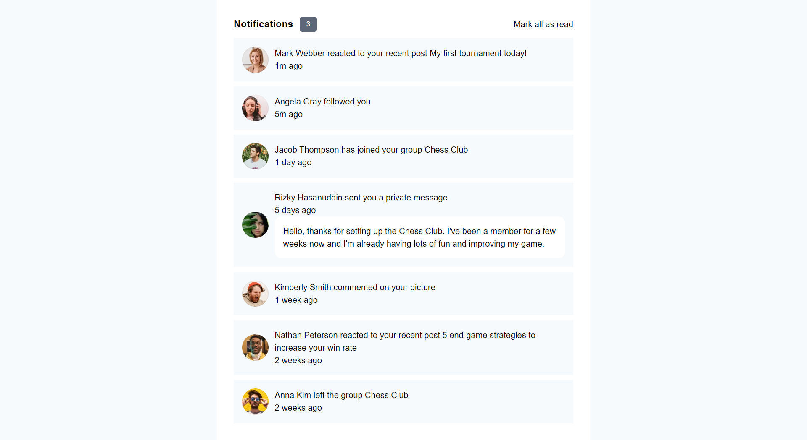

# Frontend Mentor - Manage landing page solution

This is a solution to the [Notifications page challenge on Frontend Mentor](https://www.frontendmentor.io/challenges/notifications-page-DqK5QAmKbC). Frontend Mentor challenges help you improve your coding skills by building realistic projects. 

## Table of contents

- [Overview](#overview)
  - [The challenge](#the-challenge)
  - [Screenshot](#screenshot)
  - [Links](#links)
- [My process](#my-process)
  - [Built with](#built-with)
  - [What I learned](#what-i-learned)
- [Author](#author)
- [Acknowledgments](#acknowledgments)

## Overview

The notification page built in React, HTML, and CSS is a user-friendly solution for managing notifications. It offers real-time updates, customizable notifications, and categorization options. With its responsive design, users can easily access and interact with notifications across different devices. The page also provides features for notification management, including marking as read and dismissing notifications. Visual cues and interactive feedback enhance the user experience. Overall, this notification page enables efficient handling of notifications, keeping users informed and engaged.

### The challenge

Users should be able to:

- Distinguish between "unread" and "read" notifications
- Select "Mark all as read" to toggle the visual state of the unread notifications and set the number of unread messages to zero
- View the optimal layout for the interface depending on their device's screen size
- See hover and focus states for all interactive elements on the page

### Screenshot

### Links

- Solution URL: [Solution Repository](https://github.com/wolfgunblood/notification-page)
- Live Site URL: [Live Demo](https://wolfgunblood.github.io/notification-page/)

## My process

### Built with

- Semantic HTML5 markup
- CSS custom properties
- Flexbox
- CSS Grid
- Mobile-first workflow
- [React](https://reactjs.org/) - JS library

### What I learned

Through building the Notification Page" project, I have learned:

- Developing a notification system using React, HTML, and CSS.
- Implementing real-time updates for instant notification delivery.
- Designing a responsive layout to ensure compatibility across various devices.
- Customizing notification styles and options to suit different user preferences.
- Categorizing notifications to improve organization and prioritization.
- Enabling user actions such as marking notifications as read or dismissing them.
- Utilizing visual cues and interactive elements to enhance the user experience.
- Incorporating efficient data management techniques for handling and displaying notifications.
- Testing and debugging the notification page to ensure its functionality and reliability.
- Gaining practical experience in front-end development, user interface design, and user experience considerations.

## Author

- Website - [Jalaj](https://wolfgunblood.github.io/portfolio/)
- Frontend Mentor - [@wolfgunblood](https://www.frontendmentor.io/profile/wolfgunblood)
- Twitter - [@jalaj_dorai](https://twitter.com/jalaj_dorai)

## Acknowledgments

I would like to express our gratitude to Frontend Mentor (https://www.frontendmentor.io) for providing the design and inspiration for this project. Frontend Mentor offers a vast collection of design challenges and projects that allow developers to enhance their skills by building real-world applications.